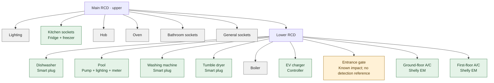

# Electrical circuit monitoring

These alerts detect **possible** power outages from the loss of communication
with devices powered by each circuit. They do not measure voltage or confirm
whether a protective device is open or has tripped. The UPS and its automations
are managed separately and do not participate in these rules.

## Files

- `config/custom_templates/energia_circuitos.jinja`: circuit map, shared diagnosis
  and notification messages. Extend the map using devices whose power source and
  availability behavior have been verified.
- `config/packages/energia_supervision_circuitos.yaml`: binary sensors, alerts
  and the notification adapter for the family Telegram group.
- `tests/test_energy_circuits.py`: simulated outages evaluated using the actual
  templates. Run with:

  ```shell
  python -m unittest discover -s tests -p test_energy_circuits.py -v
  ```

## Electrical panel

The upper residual-current device (RCD) is the main RCD. The lower RCD supplies
the circuits in the bottom row and is downstream of the main RCD. Kitchen
sockets provide a reference outside the lower RCD's branch. Each air conditioning
Shelly EM is powered by its corresponding miniature circuit breaker (MCB).

### Physical layout

Devices and circuit labels are listed from left to right, as seen from the front
of the panel. Spanish text in parentheses reproduces the circuit labels to help
locate each breaker.

| Panel area | Devices and circuits, left to right |
| --- | --- |
| Upper left | Surge protection assembly (Protector Sobretensiones) |
| Upper right | Fronius Smart Meter; main RCD (Diferencial); lighting (Alumbrado); kitchen sockets (Enchufes Cocina) |
| Middle right | Hob (Vitrocerámica); oven (Horno); bathroom sockets (Enchufes Baños); general sockets (Enchufes) |
| Bottom row | Lower RCD (Diferencial); dishwasher (Lavavajillas); pool (Piscina); washing machine (Lavadora); tumble dryer (Secadora); boiler (Caldera); EV charger (Cargador Coche); entrance gate (Barrera); ground-floor A/C (A/A Abajo); first-floor A/C (A/A Arriba) |

### Circuit hierarchy

The diagram represents the protective hierarchy used by the monitoring rules,
based on the panel labels and the confirmed RCD relationship. It is not a wiring
diagram. The internal connections and relative electrical positions of the surge
protection assembly and Smart Meter are not established by the photograph, so
they are recorded in the layout table rather than assigned a position in this tree.



Each terminal node represents a circuit with its own MCB. Green nodes have
monitoring references, gray nodes have no verified reference, and the amber gate
node has a known operational dependency but no usable detection reference.

If the lower RCD trips, the gate will not operate. Its control module might be
powered from another circuit, so `switch.entrada_barrera` can remain available
even when the gate motor has no power. This dependency is useful for explaining
the impact of a suspected RCD trip, but the module's state does not help confirm it.

## Monitoring references

Check smart-plug circuit assignments against the history of a known outage.

| Circuit | References | Minimum loss evidence |
| --- | --- | --- |
| Kitchen sockets | Fridge and freezer | Both `unavailable` |
| Pool | Pump, lighting and meter | Two `unavailable`, with none reporting a valid state |
| Washing machine | `switch.coladuria_lavadora` | `unavailable` |
| Tumble dryer | `switch.coladuria_secadora` | `unavailable` |
| Dishwasher | `switch.cocina_lavavajillas` | `unavailable` |
| EV charger | `switch.coladuria_cargador_ev` | `unavailable` |
| Ground-floor A/C | `sensor.climatizacion_planta_baja_aire_acondicionado_total_potencia` (Shelly EM) | `unavailable` |
| First-floor A/C | `sensor.climatizacion_primera_planta_aire_acondicionado_potencia` (Shelly EM) | `unavailable` |

For switches, both `on` and `off` count as valid communication. An off relay does
not imply loss of power. `unknown`, including missing entities, counts as neither
an outage nor an available reference.

For Shelly EM devices, any finite numeric power reading, including **0 W**, counts
as an available reference. There is no consumption threshold for outage detection:
zero power is normal when an appliance is idle. Only `unavailable` counts as loss;
unknown or invalid values do not establish an outage.

The rules use the original power sensors, not derived activity sensors or the
kitchen/office consumption subtraction. Detection depends on the integration
marking the device unavailable after a lost connection instead of retaining its
last reading.

The shed, pool and barbecue cameras provide supplementary information. They are
mentioned only when `unavailable` and do not determine the diagnosis.

## Rules and limitations

1. **Possible lower RCD trip:** at least two distinct lower circuits meet their
   loss criteria, no lower circuit has a communicating reference, and at least
   one kitchen reference remains available. The three pool devices count as one
   circuit. Other lower circuits may be unknown; the rules do not wait for every
   device or camera to become unavailable.
2. **Possible individual circuit outage:** that circuit meets its loss criteria
   and at least one lower circuit has a valid communicating reference. When the
   affected circuit is a lower circuit, this reference necessarily belongs to
   another circuit. Kitchen detection can therefore still work when the washing
   machine or dryer is disconnected, provided another lower reference is available.
3. **No available references:** the failure is not attributed to an individual
   circuit or the lower RCD. A supply outage, an open main RCD and a widespread
   communication failure can produce the same pattern.
4. **One missing kitchen or pool device:** this alone does not identify a circuit
   outage. Circuits monitored by a single device provide weaker evidence; their
   messages explicitly acknowledge possible device or communication failure.

RCD priority is calculated from source entity states without waiting for another
delayed binary sensor. Once the RCD pattern appears, individual circuit alerts
stop meeting their conditions. If devices report disconnections far apart in
time, a local alert may still precede an RCD alert. Timing also depends on the
integrations.

Each hypothesis must remain true for **two minutes** before its first notification.
This starts when Home Assistant recognizes the unavailable states, not at the
physical instant of the outage. Each alert repeats **every five minutes** and can
be acknowledged independently through its `alert` entity in Home Assistant.
Partial recovery can change the diagnosis to individual circuits, which then
wait through their own delay before notifying.

There is no `done_message`. A hypothesis can become false because a reference
has disappeared, changed to `unknown`, or the failure has spread. This does not
establish recovery. A recovery notification would need to verify communication
with the affected devices.

Availability may retain stale states or respond slowly. A network failure can
also affect only part of the house. Available references reduce false alerts but
cannot exclude this case. These notifications do not replace voltage measurement
or a protective device's auxiliary contact.

## Messages and delivery

Notification messages remain in Spanish for the family group. They start with ⚠️
and list devices actually marked `unavailable`, together with references that
still report valid states. Cameras, when applicable, appear as additional evidence
without assigning a cause to their disconnection.

The lower RCD message also states the gate's conditional impact:

> If the lower RCD trip is confirmed, the entrance gate will not operate.

This describes the consequence of an actual RCD trip. It does not claim that
Home Assistant observed the gate disconnecting or confirmed the trip. The gate
is not included in the observed unavailable-device list. The boiler is not
reported as an observed failure either. A/C outages identify the corresponding
Shelly EM when it is unavailable.

Messages go to `notify.telegram_family_group` and the `despacho` voice notifier.
The `notify.energia_circuitos_familia` adapter connects `alert` to
`notify.send_message` and the Telegram entity. That action does not accept
`inline_keyboard`, so electrical alerts are acknowledged from Home Assistant
without a Telegram button.

References: [Alert](https://www.home-assistant.io/integrations/alert/),
[Template](https://www.home-assistant.io/integrations/template/),
[Notify Group implementation in HA 2026.8.3](https://github.com/home-assistant/core/blob/2026.8.3/homeassistant/components/group/notify.py),
[Telegram entity in HA 2026.8.3](https://github.com/home-assistant/core/blob/2026.8.3/homeassistant/components/telegram_bot/notify.py).

## Coverage to verify

- **Entrance gate MCB:** the gate's dependency on the lower RCD is established,
  but the control module's power source is not. A separate reference is needed
  to detect a gate-only circuit outage reliably. Gate position is not evidence
  of electrical supply.
- **Lighting, general sockets and bathroom sockets:** map existing devices to
  their actual breakers before including them as references.
- **Hob, oven and boiler:** no verified electrical monitoring reference.

Confirming a protective device's trip requires compatible auxiliary contacts or
appropriate measurement equipment, selected and installed by an electrician.

## Applying and checking the configuration

Validate the configuration and restart Home Assistant to load the package,
notification adapter and macros. Reloading automations alone is insufficient.
Full repository configuration validation runs in CI. Local validation requires
Docker through `ci/check-home-assistant.ps1`.

After applying the configuration, check the nine binary sensors and alerts, the
family destination, and availability timing against the history of a known
failure. Local tests use simulated states: they do not send Telegram messages or
verify physical wiring, integration timing or actual delivery.
